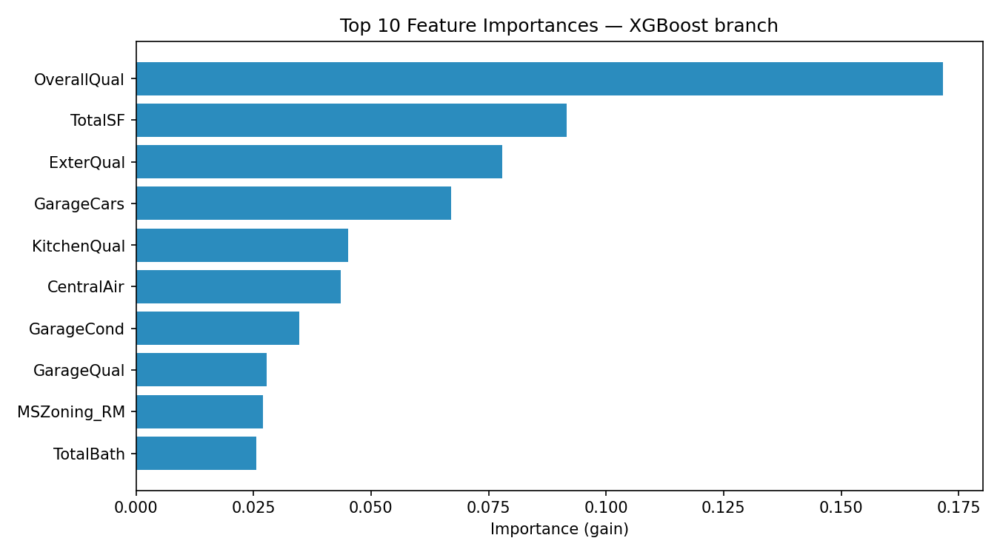

# Ames Housing — House Price Prediction (Tree + Linear Blend)

Predicts the `SalePrice` of homes in the [Ames Housing dataset](https://www.kaggle.com/c/house-prices-advanced-regression-techniques) by blending a gradient-boosted tree (XGBoost) with an L1-regularised linear model (LassoCV). Performance is reported using the competition metric, **Root Mean Squared Logarithmic Error (RMSLE)**.

## Results

5-fold cross-validated RMSLE with leak-free, fold-specific preprocessing (lower is better):

| Model            | RMSLE   | Std. dev. |
|------------------|---------|-----------|
| XGBoost (tree)   | 0.12607 | ± 0.01689 |
| LassoCV (linear) | 0.12845 | ± 0.02318 |
| **Blend (50/50)**| **0.12150** | ± 0.02030 |

The blend improves on the tree-only model by **0.00457 RMSLE (~3.6%)**.

- **Dataset:** 1,460 records, 79 raw features, 262 features after encoding
- **Validation:** 5-fold `KFold` cross-validation; all imputation, encoding, skew-correction, and scaling are fit on the training fold only to avoid leakage



## How it works

The target is modelled in **log space** (`log1p(SalePrice)`), which aligns the training objective with RMSLE and stabilises the heavy right tail of house prices.

Two models are trained on the same data with different preprocessing, then averaged:

1. **XGBoost branch** — median/mode imputation and one-hot encoding. Trees are scale-invariant, so no skew correction or standardisation is applied.
2. **LassoCV branch** — same imputation and encoding, plus `log1p` transforms on skewed continuous features (|skew| > 0.75) and standardisation. The L1 penalty (`alpha`) is selected by internal cross-validation on each fold.

Final prediction = `0.5 × tree + 0.5 × linear` (see `BLEND_WEIGHT_TREE`).

### Feature engineering

Several domain-informed features are derived, including total square footage (`TotalSF`), total bathrooms (`TotalBath`), total porch area, house age, years since remodel, and binary flags such as `HasPool`, `HasGarage`, and `HasBsmt`. Quality/condition fields (e.g. `ExterQual`, `KitchenQual`) are mapped to ordinal scales, and categoricals where `NaN` means "feature absent" are filled with `"None"` so they receive the lowest ordinal rank.

## Project structure

```
.
├── housing_prediction.py   # End-to-end pipeline: load → encode → CV → report
├── train.csv               # Training data (1,460 labelled records)
├── test.csv                # Held-out features (unlabelled)
├── requirements.txt        # Python dependencies
├── feature_importances.png # Generated on each run (XGBoost gain)
├── LICENSE
└── README.md
```

## Setup

Requires Python 3.10+.

```bash
# (optional) create and activate a virtual environment
python3 -m venv .venv
source .venv/bin/activate        # Windows: .venv\Scripts\activate

pip install -r requirements.txt
```

## Usage

```bash
python housing_prediction.py
```

This prints a multicollinearity diagnostic for the garage predictors, the 5-fold CV RMSLE for the tree / linear / blend models, and the top-10 XGBoost feature importances. It also writes `feature_importances.png` to the working directory.

> **Note:** the script currently performs cross-validated *evaluation* on `train.csv` and does not yet generate a `submission.csv` for `test.csv`. To produce Kaggle predictions you would fit each preprocessor + model on the full training set and call `.predict()` on the encoded test features.

## Data

The dataset is from the Kaggle competition *House Prices: Advanced Regression Techniques*, originally compiled by Dean De Cock. See the [competition page](https://www.kaggle.com/c/house-prices-advanced-regression-techniques) for the data dictionary and terms of use.

## License

See the [LICENSE](LICENSE) file in this repository.
